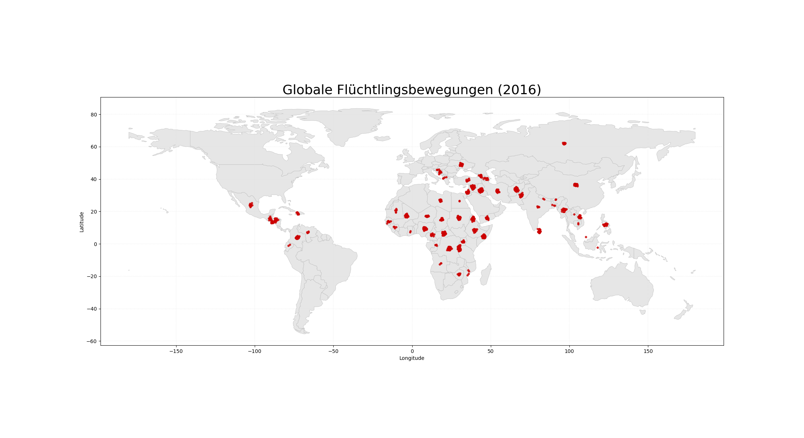
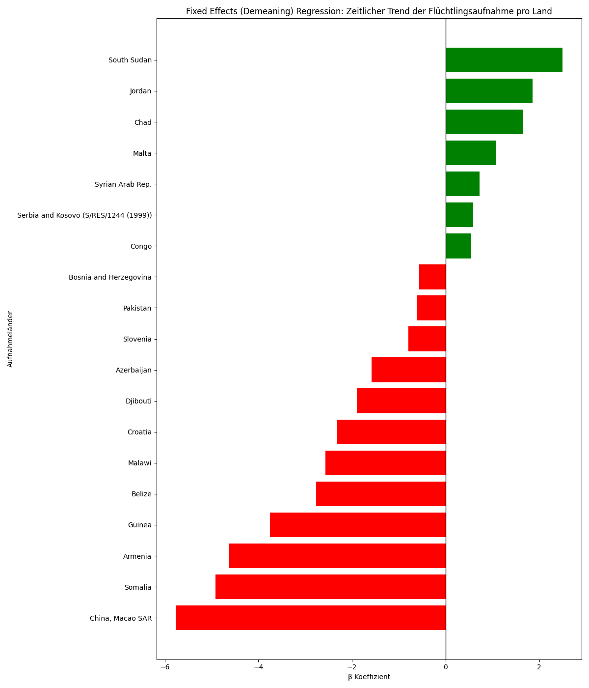
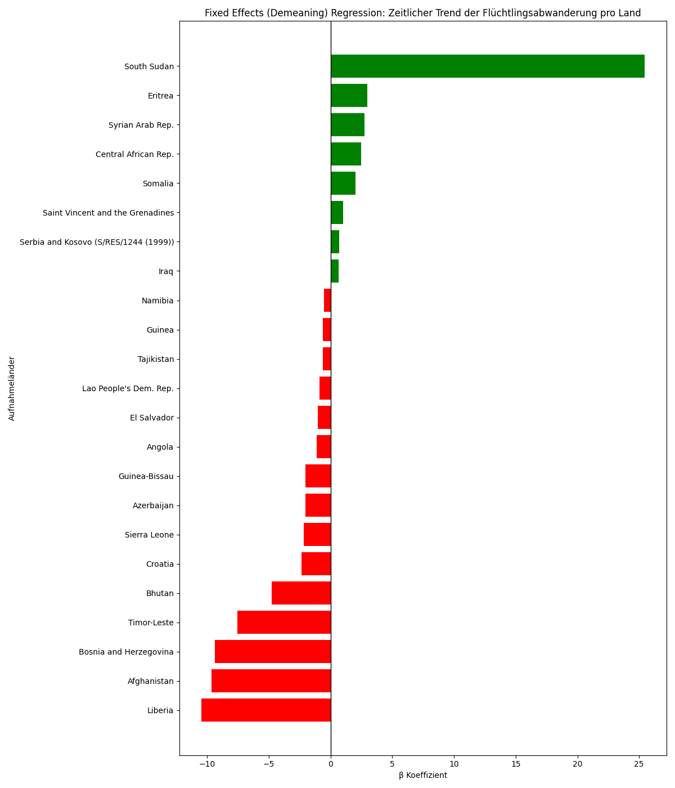

# UNHCR Refugee Flows – Data Science & Statistical Analysis

This repository analyzes global refugee and asylum seeker flows using UNHCR time series data (1951–2016), enriched with World Bank indicators (population and GDP per capita). The focus is on a clean end-to-end workflow: data preparation, feature engineering, exploratory analysis, geospatial visualization, hypothesis testing, regression, and fixed-effects panel modeling.

## Quick preview of results

### Flow visualizations (GIFs)

  
  

  
  

**What you’re seeing:**

- The **global flow map** visualizes directed movements between origins and destinations for a selected year.
- The **inflow/outflow heatmaps** show relative intensity of refugee movements by country.

### Fixed-effects panel model outputs (PNG)

  
  

**Interpretation (high-level):**

- **Left:** within-country changes over time in refugee _intake_ per 1,000 inhabitants.
- **Right:** within-country changes over time in refugee _outflow_ per 1,000 inhabitants.  
  Using fixed effects helps isolate trends **within the same country** over time, rather than mixing cross-country level differences into the estimate.

---

## Core questions

1. **Earlier vs. later decades:** How do refugee and asylum seeker flows change over time?
2. **Wealth and intake:** Is there an association between GDP per capita and refugee intake per capita?

---

## Data sources

### UNHCR (via Kaggle, stored in `archive/`)

- `time_series.csv` (main dataset, long format, 1951–2016)
- additional datasets for context/EDA:
  `persons_of_concern`, `asylum_seekers`, `asylum_seekers_monthly`, `demographics`, `resettlement`

### World Bank (stored in `additional_data/`)

- population totals by country-year
- GDP per capita by country-year

---

## Key metric (feature engineering)

### Why we normalize

Absolute refugee counts are not comparable across countries because country size dominates the level of flows. A fair comparison needs a denominator.

### Metric used

We compute a per-capita metric:

**share_per_1000 = (refugees / population) × 1000**

This makes country-year values comparable even when population sizes differ by orders of magnitude.

---

## GDP enrichment (why and how)

### Why add GDP per capita

GDP per capita is used as a broad proxy for economic capacity and living standard. The goal is not to claim causality, but to test whether there is an empirical association between relative intake and economic context.

### How we joined GDP to the flow metric

High-level steps:

1. aggregate refugee (and asylum seeker) flows by **country-year**
2. load World Bank GDP per capita by **country-year**
3. harmonize country identifiers (name mapping where required)
4. merge on `(country, year)` and carry forward the computed `share_per_1000`
5. use the merged dataset for regression / panel modeling

This produces datasets like:

- `Destination_refugees_per_capita_with_gdp.csv`
- `output_with_continent.csv` (for continent-based comparisons)

---

## Important design choices (and the reasoning)

### Missing values

In UNHCR flow data, missingness is often **structural** and not missing at random:

- origins can be `Various/Unknown`
- some country-year combinations are partially reported
- coverage varies by dataset and period

**What we did**

- inspected missingness explicitly (`EDA/Missing_Values.ipynb`)
- avoided naive imputation (mean/median imputation does not make sense for origins/flows)
- limited some analyses to population types and time windows where interpretation is strongest
- only filtered observations when a method required complete cases

**Why**
Imputation can invent flows that never existed and bias downstream inference. For this domain, preserving uncertainty is more honest than filling unknowns.

### Outliers

Refugee flows are naturally **heavy-tailed** and driven by true shocks (conflicts, crises). Extreme values are often the signal.

**What we did**

- did not remove outliers by default
- relied on per-capita normalization and careful interpretation
- preferred sensitivity thinking over deletion

**Why**
Outlier removal risks removing the most meaningful events in the data. A better approach (if needed) is robustness checks or alternative transformations, not automatic deletion.

### Scope restrictions

For cross-border flow interpretation, the core analyses focus on:

- **Refugees** (including refugee-like situations)
- **Asylum seekers**

Groups like internally displaced persons and returnees were excluded from the main flow interpretation because they do not represent cross-border movement in the same way.

---

## Repository structure

archive/ UNHCR datasets
additional_data/ World Bank population and GDP per capita
EDA/ exploratory notebooks plus missingness analysis
Hypothesen/ hypothesis notebooks plus short READMEs
output_csv_files/ processed tables used for maps and models
Output_gifs/ exported animated visualizations
output/ exported model figures

Regression.ipynb regression analysis
Panelmodell.ipynb fixed effects panel model
Static_flowmaps.ipynb static maps
Dynamic_Flowmaps.ipynb animated maps plus GIF export
geodata_preperation.ipynb geodata preprocessing
Time_Series.ipynb time series analysis

## Contact

Torsten Schmälzle  
GitHub: https://github.com/torstenschmaelzle
